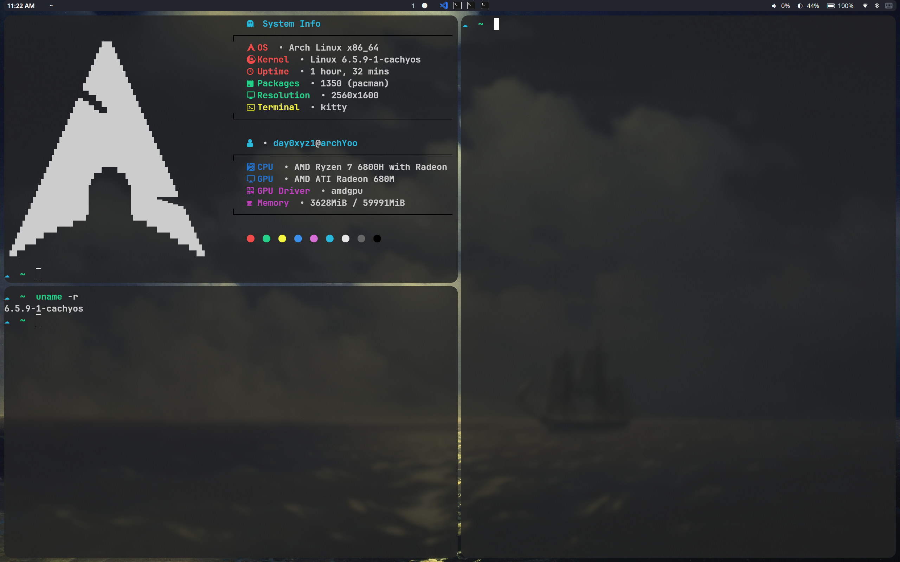

# 2023.10.30 正式退坑Hyprland
 回去用kde了


更新了我最后的配置文件，截图如下


主题需要nwg-look和qt5ct以及qt6ct来配置，qt5ct需要设置一个环境变量.<br>

屏幕缩放用的100%，因为我是放大字体来解决的。可以在hyprland.conf里配置屏幕缩放


其他配置什么的，可以去看reddit的unixporn频道。


 <br>
 <br>
 <br>
 <br>
 <br>


我的hyprland笔记，包含一些安装，配置的一些解决方案和踩坑记录/My hyprland notes, including some solutions and pitfall records





## 网站推荐

| website                                                | comment                             |
| ------------------------------------------------------ | ----------------------------------- |
| https://wiki.hyprland.org/                             | 官方wiki                            |
| https://github.com/hyprland-community/awesome-hyprland | hyprland list                       |
| https://arewewaylandyet.com/                           | wayland软件参考                     |
| https://github.com/hyprwm/Hyprland/commits/main        | commit历史，看看更新了什么          |
| https://github.com/hyprwm/hyprland-wiki/commits/main   | wiki commit历史，看看wiki更新了什么 |
| https://wiki.hyprland.org/FAQ/                         | 官方FAQ                             |


我的hyprland配置笔记

## 软件安装

### 安装hyprland

```
yay -S hyprland-git  wlroots/wlroots-git   xdg-desktop-portal-hyprland-git
```

或者,下面这个包带hidpi补丁

```
yay -S hyprland-hidpi-xprop-git
```

### 应用启动器

```
yay -S rofi-lbonn-wayland-git
```

添加配置

```
bind = SUPER, D, exec, killall rofi || rofi -show drun -theme Arc-Dark -font "Serif 16" -show-icons
bind = SUPER, S, exec, killall rofi || rofi -show window  -theme Arc-Dark -font "Serif 16" -show-icons

```


### 通知管理器

```
yay -S swaync-git
```

### waybar

```
yay -S waybar-hyprland-git
```

可能还需要装nerd 系列的字体


### 壁纸管理

```
yay -S hyprpaper-git
```

### 剪贴板管理📋

```
cliphist wl-clipboard
```


添加配置

```
exec-once = wl-paste --watch cliphist store
bind = SUPER, C, exec, cliphist list | rofi -dmenu -theme Arc-Dark -font "Serif 16"  | cliphist decode | wl-copy

这行是清除剪贴板记录
bind = SUPER SHIFT, C, exec,rm ~/.cache/cliphist/db
```

绑了一个快捷键，super+shift+c就是清除剪贴板记录

### 屏幕亮度管理

```
 light
```

这个需要把用户添加到video组,sudo usermod -a -G video $user

### 锁屏程序

```
swaylock
```

### 空闲守护进程

```
swayidle
```

### 蓝牙管理

```
blueman
```

### pulseaudio管理

```
yay -S  pulseaudio-bluetooth      pavucontrol   pulseaudio-alsa
```

### 认证程序

这个必须有，可以查看wiki的  **must-have** 界面

```
 polkit-kde-agent
```

添加配置

```
exec-once = /usr/lib/polkit-kde-authentication-agent-1 &
```


### 主题设置/ qt,gtk

```
yay -S  qt5-wayland qt6-wayland  nwg-look-bin qt5ct
```

qt5ct需要在/etc/environment设置

```
QT_QPA_PLATFORMTHEME=qt5ct
```

推荐一款主题 flat remix

```
yay -S flat-remix flat-remix-gtk
```

### 截图

我用的是grimblast,

```
slurp  grim grimblast-git
```

添加hyprland.conf配置

```
bind = SUPER SHIFT,S,exec,grimblast copysave area
bind = SUPER SHIFT,A,exec,grimblast copysave active
bind = SUPER SHIFT,D,exec,grimblast copysave output
```


当然flameshot也支持wayland了，可以自行安装试试

### 电源管理

如果你需要，我推荐tlp,开箱即用，还可以

```
yay -S tlp tlp-rdw tlpui
```

[tlpui](https://wiki.archlinux.org/title/TLP)是gui界面

或者另一个[slibmbookbattery](https://aur.archlinux.org/packages/slimbookbattery)

```
sudo systemctl enable --now tlp.service
sudo tlp start
然后根据提示mask掉一些东西，在重新开启服务

sudo tlp-stat -s 来查看tlp的运行状态
```

### 屏幕输出管理

```
wlr-randr
```


## 屏幕共享/obs

[参考wiki界面](https://wiki.hyprland.org/Useful-Utilities/Screen-Sharing/)

我用[the hyprland portal page](https://wiki.hyprland.org/Useful-Utilities/Hyprland-desktop-portal)   来解决obs录像

```
yay -S pipewire wireplumber obs-studio
```

1.

```
yay -S xdg-desktop-portal-hyprland-git
```

2.

在 ~/.config/hypr/scripts/目录下创建个脚本

写入 ~/.config/hypr/scripts/XDPH.sh

```
#!/bin/bash
sleep 1
killall xdg-desktop-portal-hyprland
killall xdg-desktop-portal-wlr
killall xdg-desktop-portal
/usr/lib/xdg-desktop-portal-hyprland &
sleep 2
/usr/lib/xdg-desktop-portal &
```

然后在~/.config/hypr/hyprland.conf,里写入

```
exec-once = bash  ~/.config/hypr/scripts/XDPH.sh &

来自动运行
```

## HIDPI

https://wiki.hyprland.org/Configuring/XWayland/

code01 v2给了一块16：10,2.5k的屏幕

```
用了官方wiki的这个解决方案，出现xwayland程序比如chrome出现鼠标指针太小的情况，我很难受

所以我选择缩放字体大小，nwg-look设置gtk,qt5ct设置qt5,qt6ct设置qt6软件，比如qbittorrent
```


## 热键启动程序

这点是我喜欢窗口管理器的原因，虽然kde等DE也可以，但没有WM纯粹的味道。

相比之下，windows不支持自定义热键启动，窗口resize也不支持super+鼠标右键拖动调整，真是很难用。


```
bind = ALT, E,exec, dolphin
bind = ALT, C,exec,  brave
bind = ALT SHIFT, C,exec, brave --incognito

bind = ALT, G,exec,  google-chrome-stable
bind = ALT SHIFT, G,exec,  google-chrome-stable --incognito


bind = ALT, B,exec, firefox
bind = ALT SHIFT, B,exec, firefox --private-window


bind = ALT, T,exec, telegram-desktop
bind = ALT SHIFT, V,exec, vmware
bind = ALT, V,exec, vscodium


bind = SUPER, RETURN, exec, xfce4-terminal
bind = SUPER SHIFT, Q, killactive
bind = SUPER SHIFT, M, exit
```


## 程序自启动

exec-once= 程序名


## 绑定程序到工作区

绑到工作区8

```
windowrule=workspace 8,lx-music-desktop
```


## 关于笔记本省电

### 开关动画，降低消耗

我笔记本经常外带，外带的时候如果考虑续航问题，需要关闭hyprland的一些动画

接上电源工作的时候，那么就可以肆意开启动画


参考wiki,绑定了键位来开关动画和一些配置


[wiki](https://wiki.hyprland.org/Configuring/Uncommon-tips--tricks/#toggle-animationsbluretc-hotkey)

```
wiki给的方法是，
关闭blur,animation,drop shadow,开启vfr
```


写个脚本到~/.config/scripts/下

```
#!/usr/bin/env sh
HYPRGAMEMODE=$(hyprctl getoption animations:enabled | awk 'NR==2{print $2}')
if [ "$HYPRGAMEMODE" = 1 ] ; then
    hyprctl --batch "\
        keyword animations:enabled 0;\
        keyword decoration:drop_shadow 0;\
        keyword decoration:blur 0;\
        keyword misc:vfr 1;\
        keyword misc:animate_manual_resizes 0;\
        "
    exit
fi
hyprctl reload
```

这里的脚本，关闭了动画，drop shadow,模糊，开启动态帧率，关闭手动调整窗口大小时的动画


在hyprland配置里绑定热键来开启这个模式

`super+n`

```
bind = SUPER, N, exec,bash ~/.config/hypr/scripts/battery-mode.sh
```

然后调用hyprctl reload 来重载配置，达到启用脚本之前的模式

`super+r`

```
bind = SUPER, R, exec,hyprctl reload
```


，这样就完成了双模式切换，

笔记本带出去，就super+n来关闭一些耗电的东西。

### 自动熄屏

这里利用swayidle守护程序来检测，300秒后调用hyprctl关闭屏幕，然后恢复后调用swaylock锁屏

锁屏图片我放在了~/.wallpaper/目录

```
exec-once = swayidle -w timeout 300 'hyprctl dispatch dpms off' resume 'hyprctl dispatch dpms on && swaylock -i ~/.wallpaper/swaylock.png '

```


## 一些我推荐的配置

在[misc](https://wiki.hyprland.org/Configuring/Variables/#misc)里面

| disable_hyprland_logo = true      | 关闭进入hyprland是的logo显示 |
| --------------------------------- | ---------------------------- |
| animate_manual_resizes = true     | 开启手动调整窗口大小时的动画 |
| always_follow_on_dnd  = true      | 调整窗口时，鼠标跟随位置     |
| enable_swallow = true             | 窗口吞噬                     |
| allow_session_lock_restore = true | 对swaylock用                 |


## 一些环境变量配置

```
env = XDG_CURRENT_DESKTOP,Hyprland
env = XDG_SESSION_TYPE,wayland
env = XDG_SESSION_DESKTOP,Hyprland

monitor=,highres,auto,1
```

## 动画设置

[wiki](https://wiki.hyprland.org/Configuring/Animations/)

例如

```
animation=windows,1,8,default,popin 80%
```

第二个配置 0/1 来控制动画开启和关闭

第三个配置 控制速度


### 自定义贝塞尔曲线

https://www.cssportal.com/css-cubic-bezier-generator/

https://easings.net/

参考这两个网站


我的曲线参数

```
animations {
    enabled = true

    bezier = myBezier, 0.05, 0.9, 0.1, 1.05

    animation = windowsIn, 1, 5, myBezier
    animation = windowsOut, 1, 4, default, popin 60%
    animation = border, 0, 5, default
    animation = fade, 1, 4, default
    animation = workspaces, 1, 3, default
}

```

## 触摸板设置

[wiki](https://wiki.hyprland.org/Configuring/Variables/#touchpad)

我开启的几个配置

自然滚动，打字时禁用

```
    touchpad {

        natural_scroll = yes
        disable_while_typing = true
    }

    sensitivity = -0.2 # -1.0 - 1.0, 0 means no modification.
}
```


## 窗口规则

有时候想要把某些频繁开关的窗口设置为浮动，避免频繁变动侧边窗口大小


需要写简单的正则表达式

### 设置默认浮动

### 自定义默认窗口大小

比如我把dolpin设置为默认浮动


dolphin的浮动我是根据标题名来定义的，

需要把dolphin启动目录设置为Downloads

```
# for dolphin
windowrulev2=float,title:^(Downloads.*?Dolphin)$
windowrulev2=size 50%,title:^(Downloads.*?Dolphin)$
windowrulev2=center,title:^(.*?Dolphin)$
```


rofi

```
windowrule=float,^(Rofi)$
```


xfce-terminal

这个终端我比较喜欢，没有去尝试kitty

```
#for xfce4-terminal
windowrule=center,xfce4-terminal
windowrule=float,xfce4-terminal
windowrulev2=size 50%,class:^(xfce4-terminal)$
```


几个文本编辑器

```
windowrule=float,kate
windowrulev2=size 47%,title:^(.*?Kate)$
windowrulev2=center,title:^(.*?Kate)$

windowrule=float,mousepad
windowrulev2=size 47%,title:^(.*?mousepad)$
windowrulev2=center,title:^(.*?mousepad)$


windowrule=float,kwrite
windowrulev2=size 30%,title:^(.*?kwrite)$
windowrulev2=center,title:^(.*?kwrite)$
```


gwenview,看图片用的

```
windowrulev2=size 47%,title:^(.*?Gwenview)$
windowrulev2=center,title:^(.*?Gwenview)$
windowrulev2=float,title:^(.*?Gwenview)$
```

### 绑定应用到工作区

```
windowrule=workspace 8,lx-music-desktop

静默启动
windowrule=workspace 8 silent,lx-music-desktop
```

## 插件系统


https://wiki.hyprland.org/Plugins/Using-Plugins/


## master/dwindle

我喜欢dwindle

感觉master layout类似i3wm

## 其他设置


配置笔记本  fn+ 按键的

```
# 亮度控制
bindle=,XF86MonBrightnessUp,exec,light -A 3
bindle=,XF86MonBrightnessDown,exec,light -U 3

# bind=,XF86AudioLowerVolume,exec,pamixer -d 5
# bind=,XF86AudioRaiseVolume,exec,pamixer -i 5


bind = , XF86AudioRaiseVolume, exec, pactl set-sink-volume @DEFAULT_SINK@ +5%
bind = , XF86AudioLowerVolume, exec, pactl set-sink-volume @DEFAULT_SINK@ -5%

# 音量，麦克风开关
bind = , XF86AudioMute, exec, pactl set-sink-mute @DEFAULT_SINK@ toggle
bind = , XF86AudioMicMute, exec, pactl set-source-mute @DEFAULT_SOURCE@ toggle
```

### 阻止swayidle在播放音频时的行为
安装
```
sway-audio-idle-inhibit-git
```
在hyprland配置里加一个exec-once

### 在当前工作区使用`alt+tab`切换窗口(float模式)
hyprland.conf添加
```
bind = ALT, Tab, cyclenext,
bind = ALT, Tab, bringactivetotop,
```
